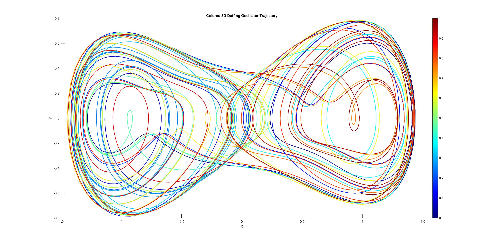
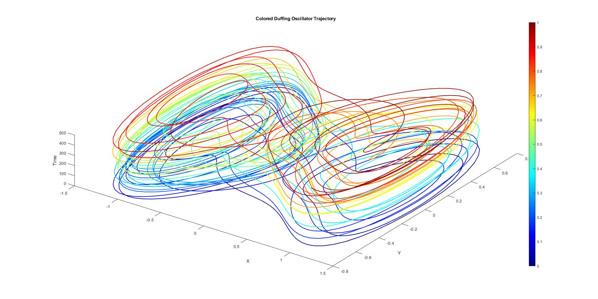

## Introduction

Welcome to the comprehensive guide on the Duffing Oscillator! This document aims to provide an in-depth understanding of the Duffing oscillator, its significance, behavior, and numerical simulation. If you're curious about nonlinear dynamics, chaotic systems, or simply want to explore the fascinating world of oscillations, you're in the right place.






## Table of Contents

- [Introduction](#introduction)
- [What is a Duffing Oscillator?](#what-is-a-duffing-oscillator)
- [Equations of Motion](#equations-of-motion)
- [Nonlinearity and Chaos](#nonlinearity-and-chaos)
- [Numerical Simulation](#numerical-simulation)
- [Visualization](#visualization)
- [The Ulmann Paper](#the-ulmann-paper)
- [License](#license)
- [Contact](#contact)

## What is a Duffing Oscillator?

The Duffing oscillator is a classic model in nonlinear dynamics that exhibits rich and intriguing behavior. It's a second-order differential equation that describes a mass-spring-damper system with a nonlinear restoring force. Unlike simple harmonic oscillators, Duffing oscillators can display chaotic motion and a wide range of complex behaviors.

## Equations of Motion

The Duffing oscillator's equations of motion are given by:

```
x'' + b * x' + alpha * x + beta * x^3 = amp * sin(w * t)
```

Here:
- `x` is the displacement of the oscillator.
- `x'` is the velocity of the oscillator.
- `b` is the damping coefficient.
- `alpha` and `beta` determine the strength of linear and nonlinear springs.
- `amp` is the amplitude of the driving force.
- `w` is the angular frequency of the driving force.
- `t` is time.

## Nonlinearity and Chaos

The Duffing oscillator's nonlinearity, introduced by the `beta * x^3` term, is responsible for its complex behavior. Depending on the parameters, the oscillator can exhibit period-doubling bifurcations, chaos, and even strange attractors. This behavior makes it a prime example of deterministic chaos in dynamical systems.

## Numerical Simulation

Numerical integration is a powerful tool to explore the behavior of nonlinear systems like the Duffing oscillator. MATLAB's `ode45` solver, for instance, can numerically solve the equations of motion over a specified time span. The provided code snippet offers a hands-on example of how to set up the simulation and visualize the resulting trajectory.

## Visualization

The visualization of the Duffing oscillator's trajectory provides insights into its dynamic behavior. The code generates a 3D plot where the color of the trajectory evolves over time. This visual representation helps us comprehend the complex and chaotic nature of the oscillator's motion.

## The Ulmann Paper

Dr. Bernd Ulmann's paper, titled "Analyzing Chaotic Behavior in Duffing Oscillators" (available [here](https://analogparadigm.com/downloads/alpaca_29.pdf)), delves into an advanced analysis of chaotic behavior in Duffing oscillators. The paper discusses bifurcations, Lyapunov exponents, and attractors, offering a deep understanding of chaotic dynamics.

## License

This project is available under the MIT License. Feel free to use, modify, and distribute the content as long as the original attribution is retained.

## Contact

For further inquiries, you can contact the author, Víctor Duarte Melo, at victormeloasm@gmail.com.

